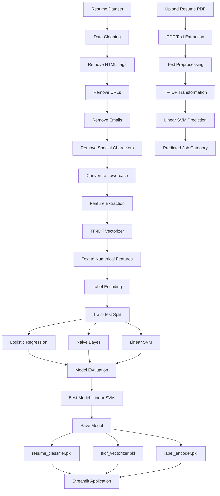
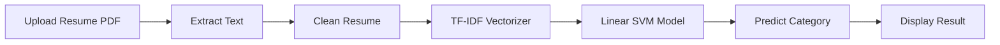

#  Resume Category Predictor

A Machine Learning and NLP-powered web application that predicts the professional category of a resume using TF-IDF Vectorization and Support Vector Machine (SVM).

Users can upload a PDF resume, and the system automatically extracts text, preprocesses it, and predicts the most relevant job category.

---

## 🚀 Features

* Upload Resume PDF
* Automatic Text Extraction
* Resume Text Preprocessing
* TF-IDF Feature Engineering
* Multi-Class Resume Classification
* Real-Time Predictions with Streamlit
* Machine Learning Powered

---

## 📊 Dataset

The project uses a Resume Dataset containing resumes from 24 professional categories.

Examples:

* Information Technology
* Business Development
* Finance
* Healthcare
* HR
* Engineering
* Banking
* Sales
* Consultant
* Designer
* Teacher

Dataset Size: ~2500 resumes

---

## 🛠 Tech Stack

### Machine Learning

* Scikit-Learn
* Linear SVM
* TF-IDF Vectorizer

### Data Processing

* Pandas
* NumPy
* Regex

### PDF Processing

* pdfplumber

### Deployment

* Streamlit

---

## 📈 Project Workflow

1. Load Resume Dataset
2. Clean Resume Text
3. Encode Categories
4. Apply TF-IDF Vectorization
5. Train Linear SVM Model
6. Evaluate Model Performance
7. Save Model Artifacts
8. Deploy using Streamlit

---

## 🧠 Models Evaluated

| Model               | Accuracy |
| ------------------- | -------- |
| Naive Bayes         | 56.14%   |
| Logistic Regression | 64.59%   |
| Linear SVM          | 74.04%   |

### Best Model

Linear Support Vector Machine (SVM)

Accuracy: 74.04%

---

## 📂 Project Structure

```text
Resume-Category-Predictor/
│
├── app.py
├── train.py
├── Resume.csv
├── resume_classifier.pkl
├── tfidf_vectorizer.pkl
├── label_encoder.pkl
├── requirements.txt
├── README.md
└── .gitignore
```

---

## ⚙️ Installation

Clone Repository

```bash
git clone https://github.com/yourusername/resume-category-predictor.git

cd resume-category-predictor
```

Install Dependencies

```bash
pip install -r requirements.txt
```

Run Application

```bash
streamlit run app.py
```

---

## 📦 Requirements

```text
streamlit
pandas
numpy
scikit-learn
joblib
pdfplumber
```

---

## 🎯 Future Improvements

* ATS Resume Scoring
* Resume vs Job Description Matching
* Skill Extraction
* Missing Skill Analysis
* Career Recommendations
* Deep Learning Models
* Transformer-based NLP Models (BERT)

---

## Architecture Diagram



---

## Prediction Workflow


---

## 👨‍💻 Author

Arpit Shirbhate

Machine Learning • Data Science • Open Source Contributor

---

⭐ If you found this project useful, consider giving it a star.
